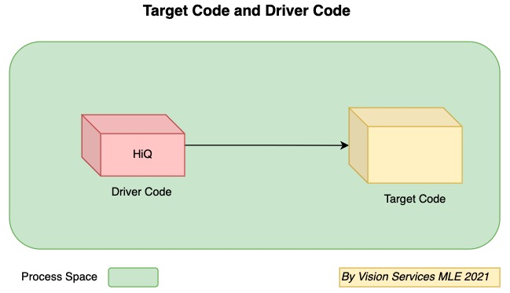

```eval_rst
Welcome to HiQ's documentation!
===============================


.. toctree::
   :maxdepth: 2
   :hidden:

   2_background
   3_concepts
   4_basics
   4_o_advanced
   5_distributed
   7_integration
   8_faq
   x_ref
   6_api

```

----


> Achieve Elite Performance in Software Development and Delivery


HiQ is a `declarative`, `non-intrusive`, `dynamic` and `transparent` tracking and optimization system for both **monolithic** application and **distributed** system. It brings the runtime information tracking and optimization to a new level without compromising on performance or losing insights.

## Environment

- Python 3.6+
- Linux, MacOS

## Installation

### Method 1 - build from local

git clone HiQ repo and cd into the source code, and run:

```python
rm -fr dist
python setup.py sdist bdist_wheel && \
pip install --force-reinstall dist/hiq-*.whl
```

### Method 2 - install with pip if you are in Oracle corp network

```bash
pip install --force-reinstall \
https://artifactory.oci.oraclecorp.com/api/pypi/ocas-service-platform-dev-pypi-local/hiq/x.y.z/hiq-x.y.z-py2.py3-none-any.whl
```

```eval_rst
.. note::

   Check `here <https://artifactory.oci.oraclecorp.com/api/pypi/ocas-service-platform-dev-pypi-local/simple/hiq/>`_ to find the latest version `0.1.*`. Please `do not` use the 1.0.0 version. `x.y.z` is the latest development head version.
```


## Quick Start

To use HiQ, you need to have `target code` and `driver code`.



Let start with a simplest example by running HiQ against a monolithic application. The target code is `main.py`:

```eval_rst
.. code-block:: python
   :linenos:

    import time


    def func1():
        time.sleep(1.5)
        print("func1")
        func2()


    def func2():
        time.sleep(2.5)
        print("func2")


    def main():
        func1()


    if __name__ == "__main__":
        main()
```

In this target code, there is a simple chain of function calls: `main()` -> `func1` -> `func2`. We can actually run the target code:

```python
cd examples
python main.py
```

And the output should be:

```
func1
func2
```

Now let's run the driver code, and if everything is fine, you should be able to see the output like this:


- Explanation of driver code

```eval_rst
.. literalinclude:: ../../examples/quick_start/main_driver.py
   :language: python
   :emphasize-lines: 5-13
   :linenos:
```

Line 1: import python module `hiq`.  
Line 5-11: create an object of class `hiq.HiQLatency` and declare we want to trace function `main()`, `func1()`, `func2()` in `main.py`.  
Line 12: call function `main()` in `main.py`.  
Line 13: print HiQ trees.


```eval_rst

Indices and tables
==================

* :ref:`genindex`
* :ref:`modindex`
* :ref:`search`

```
